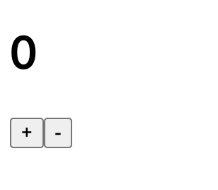

# An Introduction to Rabbita

Rabbita (formerly Rabbit-TEA) is a declarative, functional UI framework for MoonBit.

It is inspired by the Elm Architecture (TEA), which has significantly influenced 
modern state management design in frontend development. It's impact can be seen in 
libraries such as Redux and ecosystem variants like NgRx and Vuex, as well as in 
projects beyond JavaScript, including:

- Iced (Rust, native GUI)
- Bubble Tea (Go, CLI)
- Lusture (Gleam)

Rabbita supports:

- Full HTML wrappers  
- Live reload and breakpoint debugging during development  
- HTTP request APIs  
- Server-side rendering (experimental)  
- Typed DOM APIs (partial, experimental)  
- Streaming DOM diff with keyed diffing and non-dirty subtree skipping

## Quick example

Here we demonstrate how to implement a simple counter in Rabbita.  
Development is driven by defining the `Model` and `Msg` types:

```moonbit check
///|
struct Model {
  count : Int
}

///|
enum Msg {
  Inc
  Dec
}
```

`Model` represents the application state and contains a single field, `count`.  
`Msg` represents user intentions. `Inc` increases the count, and `Dec` decreases it.

Next, we define `model`, `update`, and `view`:

- `model`: the initial state of the application, matching the `Model` type.
- `update`: describes how the state changes according to a `Msg`.
- `view`: a pure function that maps the current model to HTML.

Composed together:

```moonbit check
///|
let app : Cell = @rabbita.simple_cell(
  model={ count: 0 },
  update=(msg, model) => {
    match msg {
      Inc => { count: model.count + 1 }
      Dec => { count: model.count - 1 }
    }
  },
  view=(dispatch, model) => {
    div([
      h1("\{model.count}"),
      button(on_click=dispatch(Inc), "+"),
      button(on_click=dispatch(Dec), "-"),
    ])
  },
)
```

You may notice that the types `Model` and `Msg` do not explicitly appear in the 
`simple_cell` call. This is not dynamic typing and does not rely on `Any`. MoonBit 
infers the types automatically, and everything remains statically typed. Any 
inconsistency, such as forgetting to handle `Dec` or providing an invalid initial 
model, will be caught at compile time.

```moonbit nocheck
///|
fn main {
  @rabbita.new(app).mount("main")
}
```

Now mount the `app` to a element with id `main`, that is all the MoonBit code 
needed to complete this example.

The state changes in a single, unidirectional flow:

```text
   ┌──────┐
   │ user │◀─────────┐
   └──────┘          │
       │ msg, model  │
       ▼             │
 ┌──────────┐        │
 │ update() │        │ html
 └──────────┘        │
       │ model       │
       ▼             │
  ┌────────┐         │
  │ view() │─────────┘
  └────────┘
```
At the beginning, Rabbita renders the result of `view(model)` in the browser.  
The user will see:



When the user clicks the `+` button, the `Inc` message is dispatched to the 
`update` function to produce a new model. After the model changes, it is passed 
to `view` again to update the page.

The update flow can be described as:

`new_model = update(Inc, old_model)`  
`new_view  = view(new_model)`